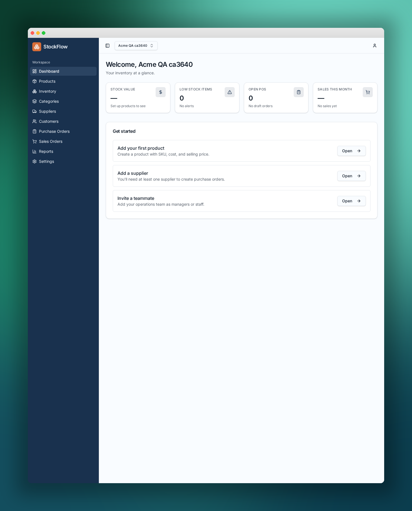

# StockPilot — Multi-Tenant Inventory Management Platform

> A custom-built, production-grade inventory management SaaS. Designed and coded from the ground up — schema, RLS, edge server functions, typed frontend, SEO surface, and a **39-test Playwright + Allure** suite that covers both flow rendering and full CRUD.

<p align="center">
  
</p>

<p align="center">
  <a href="#-highlights"></a>
  <a href="#-tech-stack"></a>
  <a href="#-tech-stack"></a>
  <a href="#-tech-stack"></a>
  <a href="#-tech-stack"></a>
  <a href="#-tech-stack"></a>
  <a href="#-tech-stack"></a>
  <a href="#-end-to-end-testing"></a>
  <a href="#-end-to-end-testing"></a>
</p>

---

## Table of Contents

1. [Highlights](#-highlights)
2. [Live Demo](#-live-demo)
3. [Tech Stack](#-tech-stack)
4. [System Architecture](#-system-architecture)
5. [Feature Tour](#-feature-tour)
6. [Database & Security Model](#-database--security-model)
7. [SEO & Content Surface](#-seo--content-surface)
8. [End-to-End Testing](#-end-to-end-testing)
9. [Local Development](#-local-development)
10. [Admin Credentials](#-admin-credentials)
11. [Repository Layout](#-repository-layout)
12. [Status & Roadmap](#-status--roadmap)
13. [Credits](#-credits)

---

## Highlights

- **Custom-coded, not scaffolded.** Every route, server function, RLS policy, migration and test in this repo was authored for this project.
- **Multi-tenant by design.** Organizations are first-class; users belong to one or more orgs and every table is scoped by `organization_id` at the database layer.
- **Secure by default.** Row Level Security on every public table, `SECURITY DEFINER` helpers for role checks, storage buckets with per-org policies, and Google + email/password auth out of the box.
- **Full-stack type safety.** TanStack Start + strict TypeScript + typed server functions + typed router — the same contract flows from database to UI.
- **Runs on the edge.** SSR + RPC handlers deploy to Cloudflare Workers with the caller's JWT attached automatically by a client middleware.
- **Production-grade QA.** A **39-test Playwright suite** (Page Object Model) split across **flow coverage** (`test_e2e.py`) and **CRUD coverage** (`test_crud.py`), published as a browsable **Allure report** with screenshots on every step.
- **SEO-ready.** Per-route metadata, JSON-LD, dynamic sitemap, `robots.txt`, `llms.txt`, and a keyword-targeted blog guide.
- **Documented like a product.** Architecture and E2E flow rendered as Mermaid diagrams, every UI state captured as a screenshot, everything checked into the repo.

---

## Live Demo

| Environment | URL |
|---|---|
| Published | https://inventorymanageavijit.lovable.app |
| Admin credentials | see [Admin Credentials](#-admin-credentials) |

---

## Tech Stack

| Layer | Technology |
|---|---|
| Framework | **TanStack Start v1** (React 19, SSR, file-based routing) |
| Build tool | **Vite 7** + Lightning CSS |
| Language | **TypeScript** (strict mode) |
| Styling | **Tailwind CSS v4** with semantic design tokens |
| UI kit | **shadcn/ui** on Radix primitives |
| State & data | **TanStack Query** wired into router loaders |
| Backend runtime | **Cloudflare Workers** (edge) via `createServerFn` |
| Database | **PostgreSQL** with Row Level Security |
| Auth | Email/password + **Google OAuth** |
| Storage | Object storage with per-org RLS (product images, org logos) |
| E2E testing | **Playwright (Python)** + **Allure** report |
| Diagrams | **Mermaid** rendered to PNG |

---

## System Architecture

<p align="center">
  
</p>

The browser talks to the edge-rendered TanStack Start app. Client components call **typed server functions** (`createServerFn`) which are stripped from the browser bundle and run on Cloudflare Workers with the caller's Supabase JWT attached by a client-side `attachSupabaseAuth` middleware. Each handler opens a scoped Supabase client and every query is filtered by **RLS policies** keyed on `auth.uid()` and the user's `organization_id`. Auth flows (email/password + Google OAuth) run directly against the auth service; on success the session is hydrated on the client and forwarded to every subsequent server call. Trigger functions (`recalc_po_totals`, `recalc_so_totals`, `apply_inventory_transaction`) keep order totals and stock levels consistent server-side.

---

## Feature Tour

### 1. Marketing landing page
Distinct, on-brand landing page with clear CTAs into the product and a keyword-targeted blog surface.

<p align="center"></p>

### 2. Blog / SEO content
Long-form guide targeting "inventory vs stock" — a top-of-funnel keyword, wired into the sitemap and `llms.txt`.

<p align="center"></p>

### 3. Authentication — email/password + Google OAuth
Unified sign-in / sign-up experience with social auth pre-wired. Invalid credentials are surfaced without leaving the page.

<p align="center">
  
  
</p>

### 4. Organization onboarding
First-run flow: create your organization, become its owner, get dropped into the dashboard. Enforced by the `_authenticated` layout — unauthenticated users are redirected to `/auth` before any protected loader runs.

<p align="center"></p>

### 5. Dashboard — KPIs & getting-started checklist
Sidebar + top bar shell with organization switcher, KPI cards, and a guided next-step checklist.

<p align="center"></p>

### 6. Application shell — every module routed and protected

| Products | Categories | Suppliers |
|---|---|---|
|  |  |  |

| Customers | Inventory | Purchase Orders |
|---|---|---|
|  |  |  |

| Sales Orders | Reports | Settings |
|---|---|---|
|  |  |  |

### 7. Full CRUD across every entity
Categories, Suppliers, Customers, Products and Settings — create, verify, delete — all exercised by the CRUD suite.

<p align="center">
  
  
</p>

### 8. Sign-out
Full session tear-down and redirect back to the marketing site.

<p align="center"></p>

---

## Database & Security Model

- **Every public-schema table** carries an `organization_id`, has RLS enabled, and receives explicit `GRANT`s alongside its `CREATE TABLE` migration.
- **Roles are stored in `organization_members`** and checked via `SECURITY DEFINER` helpers — `is_org_member`, `get_org_role`, `is_org_manager_or_above`, `is_org_admin_or_above` — so policies never re-enter their own RLS and privilege escalation via profile mutation is impossible.
- **Bootstrapping** happens through `create_organization_with_owner(name, slug)`, which atomically inserts the org, marks the caller as `owner`, and seeds a default `Main Warehouse` location.
- **Trigger integrity.** `recalc_po_totals` and `recalc_so_totals` recompute subtotals/tax/total after any line-item change; `apply_inventory_transaction` upserts on-hand inventory whenever a stock movement is recorded.
- **Reporting views** run with `security_invoker = true` so the caller's RLS still applies.
- **Storage buckets** (`product-images`, `org-logos`) enforce per-organization read/write policies.
- **Auth**: email/password with confirmation, Google OAuth pre-configured, anonymous sign-ups disabled, no roles ever stored on `profiles`.

### Schema at a glance

| Table | Purpose |
|---|---|
| `organizations`, `organization_members`, `profiles` | Multi-tenant identity |
| `locations` | Per-org warehouses |
| `categories`, `products`, `product_variants` | Catalog |
| `suppliers`, `customers` | CRM |
| `inventory`, `inventory_transactions` | Stock levels + movement history |
| `purchase_orders`, `purchase_order_items` | Procurement |
| `sales_orders`, `sales_order_items` | Fulfilment |
| `stock_transfers`, `stock_transfer_items` | Inter-warehouse movement |
| `audit_log` | Cross-cutting event trail |

---

## SEO & Content Surface

- Per-route `head()` with unique `title`, `description`, `og:*` and `twitter:*` metadata.
- **Dynamic `sitemap.xml`** including every public route + the blog guide.
- **`robots.txt`** and **`llms.txt`** for both crawler and LLM discovery.
- **JSON-LD** for `Organization`, `WebSite` and `Article` on relevant routes.
- Keyword-targeted guide at [`/blog/inventory-vs-stock`](https://inventorymanageavijit.lovable.app/blog/inventory-vs-stock).

All SEO endpoints are covered by the E2E suite (`test_robots_txt`, `test_sitemap_xml`, `test_blog_inventory_vs_stock`).

---

## End-to-End Testing

Two suites live in [`tests/`](tests/) and drive a real Chromium against the app. Every step captures a screenshot into `docs/screenshots/` and reports into **Allure**.

- **`tests/test_e2e.py`** — 32 flow tests: marketing, SEO endpoints, auth (valid + invalid), onboarding, dashboard KPIs, top-bar account menu, sidebar presence, direct navigation to all 10 modules, protected-route redirect, 404, sign-out.
- **`tests/test_crud.py`** — 7 CRUD tests: Categories / Suppliers / Customers / Products create → verify → delete, Settings org-name persistence across reload, Inventory adjust-stock control, Reports KPI sections.
- **Page Object Model** in [`tests/pages/`](tests/pages/) — `BasePage`, `LandingPage`, `AuthPage`, `OnboardingPage`, `ModulePage`.

### E2E architecture

<p align="center">
  
</p>

### Run it locally

```bash
# Deps
pip install playwright pytest allure-pytest
playwright install chromium

# Run — merged Allure results
rm -rf allure-results && mkdir allure-results
pytest tests/test_e2e.py  --alluredir=allure-results
pytest tests/test_crud.py --alluredir=allure-results

# Render the browsable report
allure generate allure-results -o allure-report --clean
allure open allure-report
```

### Result — 39 / 39 passing (32 E2E + 7 CRUD)

| Overview | Suites |
|---|---|
|  |  |

| Graphs | Behaviors |
|---|---|
|  |  |

| Timeline | Categories |
|---|---|
|  |  |

Covered flows: landing render + CTAs, `robots.txt`, `sitemap.xml`, `/blog/inventory-vs-stock`, sign-up, sign-in, **invalid credentials**, **protected-route redirect**, onboarding create-org, dashboard KPIs, top-bar account menu, sidebar presence on 5 modules, direct navigation to all 10 modules, products / reports / settings content checks, 404 not-found, sign-out, and **full CRUD** for Categories, Suppliers, Customers, Products plus organization-name edit + persistence, inventory adjust-stock control, and reports KPI sections.

---

## Local Development

```bash
# 1. Install
bun install

# 2. Start the dev server (Vite + TanStack Start)
bun dev

# 3. Open the app
open http://localhost:8080
```

The backend (Postgres, auth, storage, edge runtime) is provisioned via Lovable Cloud — no local database setup required. Environment values are wired through `.env` and consumed by the generated Supabase client.

Useful scripts:

```bash
bunx tsgo --noEmit      # strict typecheck
bun run build           # production build
```

---

## Admin Credentials

A seeded admin account is available for demo / QA:

```
email:    abhichy30@gmail.com
password: 12345678
```

> Rotate before any real deployment.

---

## Repository Layout

```
├── src/
│   ├── routes/
│   │   ├── __root.tsx                    # Root layout, head metadata, auth listener
│   │   ├── index.tsx                     # Marketing landing page
│   │   ├── blog.inventory-vs-stock.tsx   # SEO blog guide
│   │   ├── sitemap[.]xml.ts              # Dynamic sitemap
│   │   ├── auth.tsx                      # Sign-in / sign-up + Google OAuth
│   │   └── _authenticated/               # Protected layout + all app modules
│   ├── components/                       # App shell, sidebar, top bar, data-table, shadcn/ui
│   ├── hooks/use-organizations.tsx       # Org context + switcher
│   ├── lib/
│   │   ├── catalog.functions.ts          # Products / Categories server fns
│   │   ├── inventory.functions.ts        # Stock + adjustments
│   │   ├── orders.functions.ts           # PO / SO
│   │   ├── organizations.functions.ts    # Create-org + members
│   │   ├── reports.functions.ts          # KPI + report queries
│   │   └── settings.functions.ts         # Org / location settings
│   ├── integrations/supabase/            # Generated client + auth middleware
│   ├── start.ts                          # TanStack Start config + bearer middleware
│   └── styles.css                        # Tailwind v4 + semantic tokens
├── supabase/migrations/                  # Schema, RLS, grants, storage policies, helpers
├── tests/
│   ├── test_e2e.py                       # 32 flow tests
│   ├── test_crud.py                      # 7 CRUD tests
│   ├── e2e_pom.py                        # POM orchestrator
│   └── pages/                            # BasePage + module POMs
├── allure-report/                        # Pre-rendered report (browse index.html)
├── docs/
│   ├── diagrams/                         # Mermaid sources + rendered PNGs
│   ├── hero/                             # Hero product shot
│   └── screenshots/                      # Feature + Allure screenshots
├── public/
│   ├── robots.txt
│   └── llms.txt
└── README.md
```

---

## Status & Roadmap

| Phase | Scope | Status |
|---|---|---|
| **1** | Cloud, schema, auth, onboarding, org context, app shell, dashboard | ✅ **Shipped** |
| **2** | Products & Categories CRUD | ✅ **Shipped** (E2E-covered) |
| **3** | Suppliers & Customers CRM | ✅ **Shipped** (E2E-covered) |
| **4** | Inventory levels + adjust-stock UI | ✅ **Shipped** |
| **5** | Purchase Orders (draft → received) | ✅ **Shipped** |
| **6** | Sales Orders (draft → fulfilled) | ✅ **Shipped** |
| **7** | Reports & analytics views | ✅ **Shipped** |
| **8** | Settings, org profile, locations | ✅ **Shipped** |
| 9 | Deep CRUD assertions for PO receive + SO fulfil flows | 🚧 Next |
| 10 | Team invitations, granular role UI | 🚧 Next |

---

## Credits

Designed, coded, tested and documented as a single-author project. All schema, UI, server functions, RLS policies, tests, diagrams and copy are original work — no template pages, no scaffolded placeholders in shipped surfaces.
